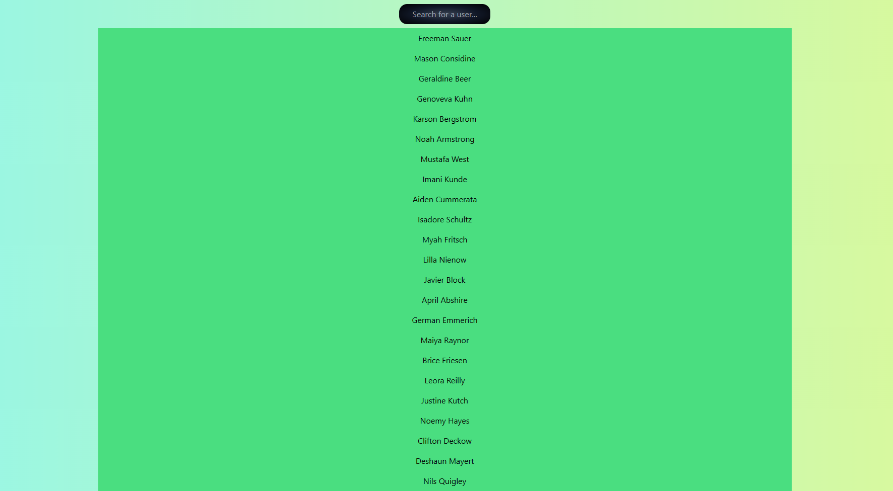

# Fetch-FakeAPI
Uso de HTML, JS y TAILWIND + FakeAPI 

Filtra los datos de 1000 usuarios por nombre y apellido que nos brinda FakeAPI.

Capturas de pantalla del proyecto: 

### Autor
- Alexandro Asencios

### Contacto
- [aa.asencios@gmail.com](mailto:aa.asenciosg@gmail.com)
